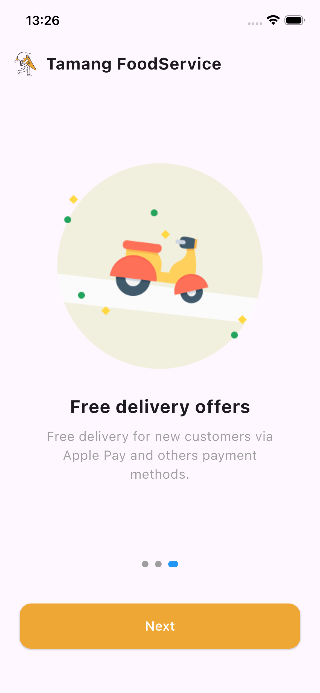
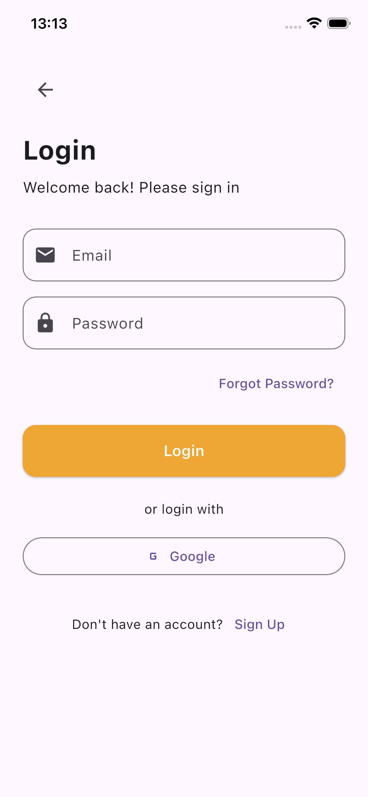

A Flutter mobile app that allows users to manage online orders seamlessly.

Table of Contents
.Features
.Screenshots
.Installation
.Usage
.Technologies
.Contributing
.License

Features
.Feature 1: e.g., User authentication with email & password
.Feature 2: WhatsApp integration for online orders
Feature 3: Push notifications
.Feature 4: Responsive UI for all screen sizes

Home Screen

Installation
Prerequisites
Flutter SDK ≥ 3.0
Dart ≥ 3.0
Android Studio / Xcode (for mobile emulators)

git clone https://github.com/yourusername/belle_full.git
cd belle_full

Usage
Open the app
Navigate through onboarding screens
Reset password if needed
Explore features like WhatsApp integration and push notifications

Technologies
Flutter & Dart
Firebase (optional, if used)
Cloudinary / AWS / Google Cloud (for media & backend integration)
